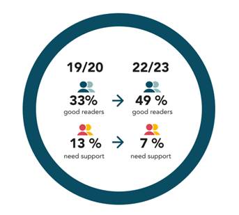

# Tool Evaluation Report

We're working for Outwood Academy, a Multi-Academy Trust with over 7,000 students, 800 staff, and over 10,000 parents, the administrative costs are significant. Last year, £200,000 was spent on student services, HR, and IT helpdesk combined. The following report details ways in which your Trust can streamline key school services such as meeting different learning needs, reducing teachers workload, and streamlining student services and HR.  

## Executive Summary

This report evaluates three educational technology tools: Ivy.ai, Lexplore, and Gradescope. Each of these tools provides significant benefits in the educational space, from automating administrative and assessment tasks to enhancing student learning. However, each tool also has associated risks, particularly in areas like data privacy, AI bias, and integration challenges. This report offers a detailed analysis of each tool's opportunities, risks, and recommendations for adoption.

## Introduction
The integration of AI in education has the potential to revolutionize the way institutions manage administrative tasks and deliver learning. In this report, we assess three AI tools: Ivy.ai, Lexplore, and Gradescope. Each technology offers unique features designed to improve educational outcomes, support educators, and streamline administrative processes. The report explores the key features, opportunities, and risks of each tool and provides recommendations for their use in educational institutions.

## Tool Evaluations

### 1. Ivy.ai
**About Ivy.ai:**  
Ivy.ai is an AI-powered chatbot platform designed to support universities and colleges. It automates administrative tasks related to student services, IT helpdesks, and recruitment campaigns by gathering data and improving through user interactions.

**Opportunities:**  
Ivy.ai can reduce administrative workloads, streamline communications with students, parents, and staff, and provide essential information on services like tuition, scholarships, and more. For institutions with large student bodies, Ivy.ai could save significant resources by centralizing services.

**Case Studies:**
Temple University: Reduced call volume by 50%.
Broward College: Saved $500,000.
Students prefer chatbots over search engines.

**Risks:**  
Risks include job displacement due to automation, challenges with system integration, and data privacy concerns. Ivy.ai’s integration with legacy systems may prove difficult, and it must adhere to strict privacy regulations like GDPR.

**Evaluation and Recommendation:**  
While the risk of job displacement and data privacy concerns exists, the overall benefits in cost reduction and efficiency outweigh the risks. Institutions should begin with a pilot program, conduct a data privacy assessment, and offer training to ensure smooth adoption and ongoing monitoring.

### 2. Lexplore
**About Lexplore:**  
Lexplore uses AI and eye-tracking technology to assess students' reading abilities, specifically to detect dyslexia. This tool can analyze reading patterns in just a few minutes, allowing teachers to tailor instruction to meet individual needs.

**Opportunities:**  
Lexplore can help schools identify students with dyslexia early, allowing for timely intervention and personalized instruction. This improves student outcomes and supports teachers in preparing appropriate lessons for students with special needs.

**Risks:**  
There are concerns regarding the security and accuracy of the AI system. Lexplore mitigates this with robust data encryption, multifactor authentication, and regular data audits. However, the accuracy of the tool must be continuously verified to maintain trust in the system.

**Evaluation and Recommendation:**  
Lexplore is a valuable tool for identifying dyslexia and supporting students with reading difficulties. Despite concerns about data security, the benefits to students and educators justify its implementation in schools, particularly for early intervention programs.

**Case Studies:**

### 3. Gradescope
**About Gradescope:**  
Gradescope is an AI tool that automates the grading process for various assignment types, including multiple-choice, handwritten, and coding assignments. It is widely used in large institutions to streamline grading and feedback, offering an Autograder feature for coding assignments.

**Opportunities:**  
Gradescope can significantly reduce teachers' grading workloads, enhance the feedback provided to students, and ensure consistency in grading. It supports a wide range of assignment types, allowing teachers to focus more on instruction and less on administrative tasks. 

Pros: 

Efficient grading
Quick student submissions
Provides enhanced feedback for students
Ensures academic integrity 

👎Cons:

Has a learning curve
May have technical glitches
Some features are expensive  

The Institutional plan offers many more benefits, while the Basic plan is limited to several features:

Dynamic Rubrics
Question by Question Grading
Basic Assignment Types
Student-uploaded and Instructor-uploaded PDF
Assignment Statistics
Regrade Requests
Data Export
Student Mobile App

**Risks:**  
Gradescope presents a learning curve for new users and may encounter occasional technical glitches. Additionally, the platform's premium features can be costly, which may be a barrier for smaller institutions or individual users.

Some of the potential risks around security can be found here:
https://www.upguard.com/security-report/gradescope

**Evaluation and Recommendation:**  
Gradescope offers substantial benefits in terms of efficiency and grading consistency. Its features, particularly the AI-Assisted Grading and Autograder, make it a valuable tool for educational institutions, especially those handling large student populations. It is recommended for adoption, with attention to training and support for educators to ease the learning curve.

## Conclusion and Recommendations
Each of the evaluated tools— Ivy.ai, Lexplore, and Gradescope— provides unique benefits to educational institutions by automating and improving key processes. Ivy.ai can streamline administrative work, Lexplore can enhance student assessments, and Gradescope can reduce the workload of teachers. While there are risks associated with data privacy and the integration of AI, careful planning, pilot testing, and ongoing monitoring can help mitigate these concerns. It is recommended that institutions adopt these tools with specific strategies in place to ensure a smooth and successful integration.

